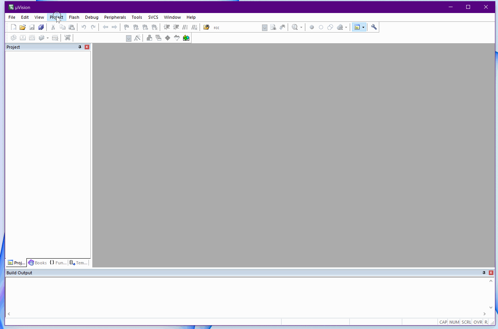
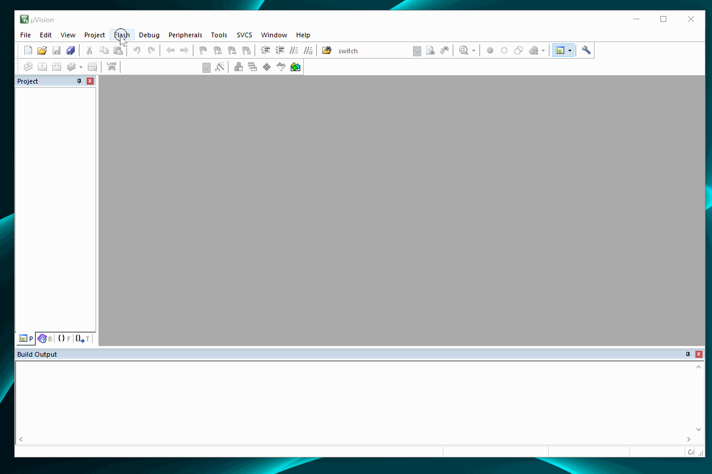
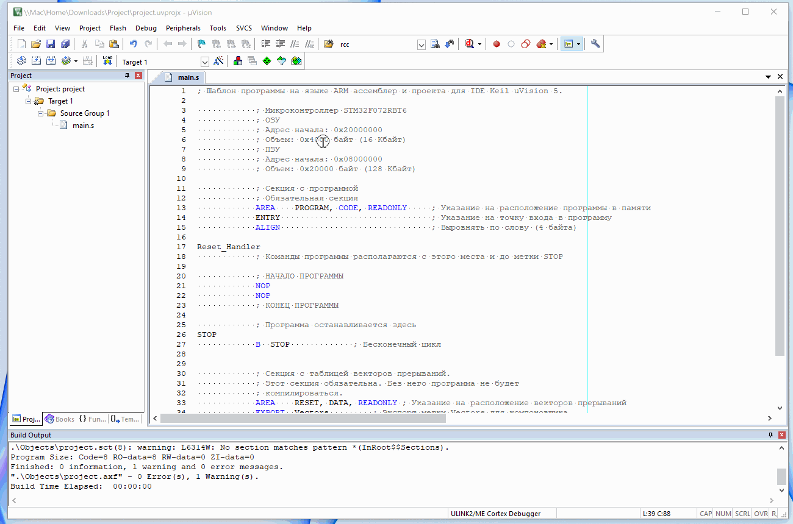
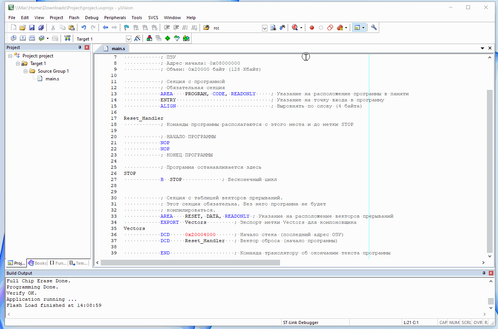

# Курс "Микропроцессорные устройства"

Кафедра [Промышленная электроника](https://mpei.ru/Structure/Universe/ire/structure/ie/Pages/default.aspx) [НИУ МЭИ](https://mpei.ru/).

 

## Оглавление

- [Курс "Микропроцессорные устройства"](#курс-микропроцессорные-устройства)
  - [Оглавление](#оглавление)
  - [Преподаватели](#преподаватели)
  - [Обзор курса](#обзор-курса)
  - [Цели](#цели)
  - [Предварительные требования](#предварительные-требования)
  - [Структура курса](#структура-курса)
    - [Часть 1](#часть-1)
    - [Часть 2](#часть-2)
    - [Лекции](#лекции)
    - [Практические занятия](#практические-занятия)
    - [Лабораторные работы](#лабораторные-работы)
    - [Зачет и экзамен](#зачет-и-экзамен)
  - [Материалы курса](#материалы-курса)
    - [Клонирование репозитория](#клонирование-репозитория)
    - [Загрузка репозитория в виде zip архива](#загрузка-репозитория-в-виде-zip-архива)
  - [Перечень директорий репозитория](#перечень-директорий-репозитория)
  - [Литература](#литература)
  - [Полезные ссылки](#полезные-ссылки)
  - [Учебный стенд](#учебный-стенд)
  - [Установка и настройка инструментов разработки](#установка-и-настройка-инструментов-разработки)
    - [Keil uVision5](#keil-uvision5)
      - [Создание нового проекта для языка Ассемблер в Keil uVision5](#создание-нового-проекта-для-языка-ассемблер-в-keil-uvision5)
      - [Создание нового проекта для языка C в Keil uVision5](#создание-нового-проекта-для-языка-c-в-keil-uvision5)
      - [Настройка подключения ST-Link в Keil uVision5](#настройка-подключения-st-link-в-keil-uvision5)
      - [Настройка симулятора](#настройка-симулятора)
      - [Работа в отладчике](#работа-в-отладчике)
      - [Исправление ошибки загрузки программы в Keil uVision5](#исправление-ошибки-загрузки-программы-в-keil-uvision5)
    - [vscode gcc](#vscode-gcc)
      - [Windows](#windows)
      - [Linux](#linux)
      - [MacOS](#macos)
      - [Текстовый редактор vscode](#текстовый-редактор-vscode)
  - [Ошибки и опечатки](#ошибки-и-опечатки)

## Преподаватели

Александр Николаевич Смирнов

Электронная почта: [smirnovalnik@mpei.ru](mailto:smirnovalnik@mpei.ru)

Практические занятия и лабораторные работы проводиться преподавателями выпускающих кафедр.

## Обзор курса

Курс предначен для студентов бакалавриата четвертого года обучения факультета электронной техники.
Курс знакомит с основами микропроцессорной техники, программированию микроконтроллеров на языке Ассемблер и C.

## Цели

Целями первой части курса являются:

- изучение принципов построения микропроцессорных устройств
- изучение языка программирования Ассемблер и его применения для встраиваемых микропроцессорных систем

Целями второй части курса являются:

- изучение периферийных модулей микроконтроллера _STM32F072RBT6_
- изучение языка программирования C и его применения для встраиваемых микропроцессорных систем

## Предварительные требования

Студент должен обладать навыками программирования на одном языке высокого уровня,
знать основы аналоговой и цифровой схемотехники.

## Структура курса

Курс состоит из двух частей: осенний семестр (часть 1) и весенний семестр (часть 2).

### Часть 1

- Лекции
  - Лекция №1: Принципы организации цифровых систем управления и преобразования цифровых сигналов
  - Лекция №2: Структура микропроцессорной системы
  - Лекция №3: Память в микропроцессорной системе
  - Лекция №4: Память в микропроцессорной системе
  - Лекция №5: Устройства ввода/вывода
  - Лекция №6: Система команд центрального процессора
  - Лекция №7: Структура центрального процессора
  - Лекция №8: Структура центрального процессора
  - Лекция №9: Обмен информацией в микропроцессорной системе
  - Лекция №10: Режим прерывания
  - Лекция №11: Режим прямого доступа к памяти
  - Лекция №12: Модульный принцип построения микроконтроллера
  - Лекция №13: Системные модули микроконтроллера
  - Лекция №14: Система тактирования микроконтроллера
  - Лекция №15: Порты ввода/вывода общего назначения
  - Лекция №16: Особенности центральных процессоров различных архитектур
- Практические занятия
  - Практическое занятие №1: Команды загрузки данных ([пример](./examples/part1/workshop/ex1/))
  - Практическое занятие №2: Команды обработки данных ([пример](./examples/part1/workshop/ex2/))
  - Практическое занятие №3: Команды ветвления ([пример](./examples/part1/workshop/ex3/))
  - Практическое занятие №4: Команды вызова подпрограмм ([пример](./examples/part1/workshop/ex4/))
  - Практическое занятие №5: Поиск наибольшего элемента в массиве ([пример](./examples/part1/workshop/ex5/))
  - Практическое занятие №6: Сортировка массива ([пример](./examples/part1/workshop/ex6/))
  - Практическое занятие №7: Порт ввода/вывода общего назначения([пример](./examples/part1/workshop/ex7/))
  - Практическое занятие №8: Мигающий светодиод ([пример](./examples/part1/workshop/ex8/))
- Лабораторные работы
  - Лабораторная работа №1: Команды обработки данных и загрузки данных ([пример](./examples/part1/labs/lab1/))
  - Лабораторная работа №2: Поиск элеметов в массиве данных ([пример](./examples/part1/labs/lab2/))
  - Лабораторная работа №3: Обработка массива данных ([пример](./examples/part1/labs/lab3/))
  - Лабораторная работа №4: Логическая функция ([пример](./examples/part1/labs/lab4/))
- Зачет с оценкой

### Часть 2

- Лекции
  - Лекция №1: Структура микроконтроллера
  - Лекция №2: Взаимодействие центрального процессора и периферийных модулей
  - Лекция №3: Порты ввода/вывода общего назначения
  - Лекция №4: Аналогово цифровой преобразователь
  - Лекция №5: Способы обработки прерываний
  - Лекция №6: Таймер-счетчик общего назначения
  - Лекция №7: Каналы выходного сравнения таймера-счетчика
  - Лекция №8: Каналы входного захвата таймера-счетчика
  - Лекция №9: Последовательный ввод/вывод
  - Лекция №10: Последовательный ввод/вывод: SPI
  - Лекция №11: Последовательный ввод/вывод: UART
  - Лекция №12: Последовательный ввод/вывод: I2C
  - Лекция №13: Последовательный ввод/вывод: CAN
  - Лекция №14: Подсистема тактирования МК
- Практические занятия
  - Практическое занятие №1: Порты ввода/вывода МК ([пример](./examples/part2/workshop/ex1))
  - Практическое занятие №2: Подсистема аналогового ввода/вывода МК ([пример](./examples/part2/workshop/ex2))
  - Практическое занятие №3: Подсистема прерывания МК ([пример](./examples/part2/workshop/ex3))
  - Практическое занятие №4: Подсистема реального времени МК: "бегущий огонь" ([пример](./examples/part2/workshop/ex4))
  - Практическое занятие №5: Подсистема реального времени МК: регулирование яркости ([пример](./examples/part2/workshop/ex5))
  - Практическое занятие №6: Подсистема последовательного ввода/вывода МК: UART ([пример](./examples/part2/workshop/ex6))
  - Практическое занятие №7: Подсистема последовательного ввода/вывода МК: SPI, I2C ([пример](./examples/part2/workshop/ex7))
- Лабораторные работы
  - Лабораторная работа №1: Подсистема аналогового ввода/вывода МК ([пример](./examples/part2/labs/lab1/))
  - Лабораторная работа №2: Подсистема реального времени МК ([пример](./examples/part2/labs/lab2/))
  - Лабораторная работа №3: Подсистема последовательного ввода/вывода МК: UART ([пример](./examples/part2/labs/lab3/))
- Экзамен

### Лекции

На лекциях изучаются теоретические вопросы работы микропроцессорных систем, а также некоторые практические вопросы по программированию этих систем.

### Практические занятия

Практические занятия проводятся преподавателями выпускающих кафедр.
Порядок проведения занятий, темы занятий и их содержание может отличаться от приведенного здесь на усмотрение преподавателя.

### Лабораторные работы

Лабораторные работы проводятся преподавателями выпускающих кафедр.
Порядок проведения занятий, темы занятий и их содержание может отличаться от приведенного здесь на усмотрение преподавателя.

Выполнение лабораторных работ предполагает предварительную самостоятельную подготовку:
создание проекта и написание исходных текстов программы.

Лабораторные работы №1, №2, №3 первой части могут быть выполнены на симуляторе.
Остальные работы выполняются на учебном стенде.

### Зачет и экзамен

Первая часть курса заканчивается зачетом с оценкой, вторая - экзаменом.

## Материалы курса

Материалы курса размещены на [GitHub](https://github.com),
который является большим хранилищем программ (исходных текстов)
под управлением системы контроля версий `git`.

Репозиторий непрерывно обновляется и поэтому рекомендуется подтягивать изменения.

Если вы не знакомы с `git`, то можете периодически скачивать архив проекта по указанной ниже инструкции.

### Клонирование репозитория

```bash
git clone https://github.com/smirnovalnik/microprocessor-units-course.git
```

### Загрузка репозитория в виде zip архива


## Перечень директорий репозитория

- [docs](./docs/) - документация на микроконтроллер и учебный стенд
  - [arm_official](./docs/arm_official/) - официальная документация (технические описания, руководства и т.д.) на процессор _ARM Cortex-M0_
  - [asm_lang](./docs/asm_lang/) - шпаргалка по ассемблеру ARM
  - [c_lang](./docs/c_lang/) - шпаргалка по языку C
  - [learning_stand](./docs/learning_stand/) - документация (спецификации, схемы электрические принципиальные, сборочные чертежи) на _Учебный стенд_
  - [mcu_st_official](./docs/mcu_st_official/) - официальная документация (технические описания, руководства и т.д.) на МК _STM32F072RBT6_ на английском языке
  - [peripheral](./docs/peripheral/) - описание регистров специальных функций МК _STM32F072RBT6_
  - [misc](./docs/misc/) - различные полезные документы
- [exam](./exam/) - вопросы к зачету и экзамену, примеры билетов
- [examples](./examples/) - примеры лабораторных работ и задачи для практических занятий
  - [part1](./examples/part1/) - для первой части курса
    - [labs](./examples/part1/labs/) - примеры лабораторных работ
      - [lab1](./examples/part1/labs/lab1/) - пример _Лабораторной работы №1 Команды обработки данных и загрузки данных_
      - [lab2](./examples/part1/labs/lab2/) - пример _Лабораторной работы №2 Поиск элеметов в массиве данных_
      - [lab3](./examples/part1/labs/lab3/) - пример _Лабораторной работы №3 Обработка массива данных_
      - [lab4](./examples/part1/labs/lab4/) - пример _Лабораторной работы №4 Логическая функция_
    - [workshop](./examples/part1/workshop/) - примеры, разобранные на практических занятиях
      - [ex1](./examples/part1/workshop/ex1/) - пример решения практической задачи: _Команды загрузки данных_
      - [ex2](./examples/part1/workshop/ex2/) - пример решения практической задачи: _Команды обработки данных_
      - [ex3](./examples/part1/workshop/ex3/) - пример решения практической задачи: _Команды ветвления_
      - [ex4](./examples/part1/workshop/ex4/) - пример решения практической задачи: _Команды вызова подпрограмм_
      - [ex5](./examples/part1/workshop/ex5/) - пример решения практической задачи: _Поиск наибольшего элемента в массиве_
      - [ex6](./examples/part1/workshop/ex6/) - пример решения практической задачи: _Сортировка массива_
      - [ex7](./examples/part1/workshop/ex7/) - пример решения практической задачи: _Порт ввода/вывода общего назначения_
      - [ex8](./examples/part1/workshop/ex8/) - пример решения практической задачи: _Мигающий светодиод_
  - [part2](./examples/part2/) - для второй части курса
    - [labs](./examples/part2/labs/) - примеры лабораторных работ
      - [lab1](./examples/part2/labs/lab1/) - пример _Лабораторной работы №1 Подсистема аналогового ввода/вывода МК_
      - [lab2](./examples/part2/labs/lab2/) - пример _Лабораторной работы №2 Подсистема реального времени МК_
      - [lab3](./examples/part2/labs/lab3/) - пример _Лабораторной работы №3 Подсистема последовательного ввода/вывода МК: SPI, UART, I2C_
    - [workshop](./examples/part2/workshop/) - примеры, разобранные на практических занятиях
      - [ex1](./examples/part2/workshop/ex1) - примеры решения четырех практических задач: _Включение светодиода_, _Включение светодиода по абсолютным адресам_,
            _Управление светодиода переключателем_, _Мигающий светодиод_
      - [ex2](./examples/part2/workshop/ex2) - примеры решения двух практических задач: _Чтение АЦП программным опросом_, _Антидребезг кнопки_
      - [ex3](./examples/part2/workshop/ex3) - примеры решения двух практических задач: _Внешние прерывания на портах ввода/вывода_, _Прерывание по окончанию преобразования АЦП_
      - [ex4](./examples/part2/workshop/ex4) - пример решения практической задачи: _Бегущий огонь_
      - [ex5](./examples/part2/workshop/ex5) - пример решения практической задачи: _Регулирование яркости светодиодов с помощью таймера_
      - [ex6](./examples/part2/workshop/ex6) - пример решения практической задачи: _Подключение внешней Flash памяти по SPI_
      - [ex7](./examples/part2/workshop/ex7) - пример решения практических задач: _Управление светодиодами через UART_
- [hardware](./hardware/) - исходные файлы проекта _Учебный стенд_ в Altium Designer
- [img](./img/) - различные картинки используемые в README файлах
- [lectures](./lectures/) - слайды и тексты программ использованные на лекциях
- [programs](./programs/) - программы для установки
- [tests](./tests/) - проекты для теста аппаратного обеспечения _Учебного стенда_
- [templates](./templates/) - шаблоны проектов

## Литература

- _Харрис Сара Л., Харрис Дэвид М. "Цифровая схемотехника и архитектура компьютера: RISC-V"_
- _Харрис Сара Л., Харрис Дэвид М. "Цифровая схемотехника и архитектура компьютера. Дополнение по архитектуре ARM"_
- _Угрюмов Е. П. "Цифровая схемотехника"_
- _Joseph Yiu "The Definitive Guide to ARM Cortex-M0 and Cortex-M0+ Processors 2nd Edition"_
- _Козаченко В.Ф., Алямкин Д.И., Анучин А.С., Жарков А.А., Лашкевич М.М., Савкин Д.И., Шпак Д.М. "Практический курс микропроцессорной техники на базе процессорных ядер ARM-Cortex-M3/M4/M4F"_
- Для обучения программированию на языке C обязательна к прочтению и **решению всех упражнений** книга
_Керниган Б., Ритчи Д. "Язык программирования C" 2-е издание._

## Полезные ссылки

- [Страница по stm32072rb от производителя](https://www.st.com/en/microcontrollers-microprocessors/stm32f072rb.html)
- [Страница по stm32f072-disco от производителя](https://www.st.com/en/evaluation-tools/32f072bdiscovery.html)

## Учебный стенд

Конструктивно стенд состоит из нескольких плат с электронными компонентами: отладочная плата _STM32F072B-DISCO_, основная плата, ЖК индикатор, модуль беспроводной передачи данных.

Основная плата содержит исполнительные устройства и устройства ввода для микропроцессорного контроллера. Эта плата разработана на кафедре Промышленной Электроники НИУ МЭИ.

Отладочная плата _STM32F072B-DISCO_ содержит изучаемый МК _STM32F072RBT6_, а также программатор _ST-LINK/V2_. Программатор позволяет загружать коды программы для микроконтроллера, которые подготовлены в ПК, в постоянную память МК и затем наблюдать на экране монитора ПК за исполнением этой программы микроконтроллером.

Плата _STM32F072RBT6_ содержит небольшое количество устройств ввода и вывода информации. Плата с внешними элементами расширяет возможности по вводу и выводу, что позволяет создать множество различных учебных заданий, используя индикацию и всевозможные кнопки и переключателями.


1. Отладочная плата _STM32F072B-DISCO_
2. Цифро-буквенный ЖКИ индикатор со встроенным контроллером
3. Переключатели для смены периферийных устройств
4. Выходы ЦАП с разъемом BNC
5. Вход АЦП по SPI с разъемом BNC
6. Вход АЦП с разъемом BNC
7. 16 RGB светодиодов (LED1-LED16)
8. Переключатели для выбора канала АЦП между входами BNC и потенциометрами POT1, POT2
9. Потенциометры (POT1 и POT2)
10. Клавиатура, состоящая из 16 тактовых кнопок без фиксации
11. Тактовые кнопки без фиксации (SB1-SB4)
12. Переключатели (SW1-SW4)
13. 4-х разрядный семисегментный индикатор
14. Разъем для SD карты
15. Разъем CAN
16. Разъем USB-UART
17. Разъем питания
18. Модуль передачи данных (ZigBee, Wi-Fi, Bluetooth)

## Установка и настройка инструментов разработки

### Keil uVision5

Разработка программ для микроконтроллера проводится
в интегрированной среде разработки (Integrated Development Environment - IDE)
[Keil MDK Lite Edition](http://www2.keil.com/mdk5/editions/lite).
Для загрузки потребуется регистрация на сайте Keil.
Процесс установки ничем не отличается от установки любой другой программы для Windows.

> :bulb: **Примечание:** Избегайте русскоязычных названий директорий как в пути установки программы, так и в путях к вашим проектах. Некоторые компоненты среды разработки могут не работать.

Эта версия обладает практически полной функциональностью профессиональной версии,
но с ограничением на размер скомпилированной программы в 32 кБайта.
Для лабораторных работ и практических занятий данного курса этого более чем достаточно.

В `Keil MDK Lite Edition` есть симулятор, поэтому работу программы
можно проверить без отладочной платы. Однако данный симулятор поддерживает
только центральный процессор, но не периферийные модули микроконтроллера.

Keil MDK Lite Edition изначально ничего не знает о микроконтроллерах
фирмы ST. Поэтому потребуется скачать и установить пакет с библиотеками для `stm32f0` по ссылке
[Keil.STM32F0xx_DFP.2.1.0.pack](./programs/Keil.STM32F0xx_DFP.2.1.0.pack).

#### Создание нового проекта для языка Ассемблер в Keil uVision5



#### Создание нового проекта для языка C в Keil uVision5



#### Настройка подключения ST-Link в Keil uVision5


#### Настройка симулятора



#### Работа в отладчике



#### Исправление ошибки загрузки программы в Keil uVision5


### vscode gcc

> :bulb: **Примечание:** Использование инструментов `gcc` и `vscode` не обязательно. Все примеры практических задач и лабораторных работ сопровождаются проектом в `Keil uVision5`.

Установка всех компонентов будет происходить в командной строке.
Последовательность действий зависит от операционной системы.

Для работы потребуется кросс-компилятор `arm-none-eabi-gcc`, утилита сборки `make`, отладчик `openocd` и
текстовый редактор `Visual Studio Code` с расширениями.

#### Windows

Открыть командную строку в режиме администратора.

- Скачать и установить пакетный менеджер `Chocolatey`

    Пакетный менеджер позволит быстро устанавливать необходимые программы не прибегая к поиску установочных файлов в интернете.

    Установка выполняется командой:

    ```shell
    Set-ExecutionPolicy Bypass -Scope Process -Force; [System.Net.ServicePointManager]::SecurityProtocol = [System.Net.ServicePointManager]::SecurityProtocol -bor 3072; iex ((New-Object System.Net.WebClient).DownloadString('https://chocolatey.org/install.ps1'))
    ```

    Проверить установку следует командой:

    ```shell
    choco --version
    ```

    Если установка прошла успешно, то в командной строке напечатается версия программы, например

    ```shell
    0.10.15
    ```

- Установить кросс-компилятор `arm-none-eabi-gcc` и другие инструмент:

    ```shell
    choco install gcc-arm-embedded
    choco install make
    choco install openocd
    ```

  Проверка правильности установки:

  ```shell
  make --version
  arm-none-eabi-gcc --version
  openocd --version
  ```

  Каждая команда должна вернуть свою версию.

- Скачать и установить [текстовый редактор vscode](#текстовый-редактор-vscode).

#### Linux

- Установка в системах с пакетным менеджером `apt`:

  ```shell
  sudo apt install bin-utils
  sudo apt install arm-none-eabi-gcc
  sudo apt install openocd
   ```

  Проверка правильности установки:

  ```shell
  make --version
  arm-none-eabi-gcc --version
  openocd --version
  ```

  Каждая команда должна вернуть свою версию.

- Скачать и установить [текстовый редактор vscode](#текстовый-редактор-vscode).

#### MacOS

- Установка в системах с пакетным менеджером `brew`:

  ```shell
  brew tap ArmMbed/homebrew-formulae
  brew install arm-none-eabi-gcc
  brew install openocd
  ```

  Проверка правильности установки:

  ```shell
  make --version
  arm-none-eabi-gcc --version
  openocd --version
  ```

  Каждая команда должна вернуть свою версию.

- Скачать и установить [текстовый редактор vscode](#текстовый-редактор-vscode).

#### Текстовый редактор vscode

Инструкция применима для всех операционных систем.

Загрузить и установить с сайта версию [Visual Studio Code](https://code.visualstudio.com/) в соответствие с вашей операционной системой.


Установить расширения (extensions):

- Для работы с кодом на языке C/C++ - [C/C++ for Visual Studio Code](https://marketplace.visualstudio.com/items?itemName=ms-vscode.cpptools)

- Для визуализации отладки - [Cortex-Debug](https://marketplace.visualstudio.com/items?itemName=marus25.cortex-debug)

- Для подсветки синтаксиса ассемблера - [Arm Assembly](https://marketplace.visualstudio.com/items?itemName=dan-c-underwood.arm)

- Для подсветки синтаксиса скрипта компоновщика - [LinkerScript](https://marketplace.visualstudio.com/items?itemName=ZixuanWang.linkerscript)

## Ошибки и опечатки

Если вы нашли ошибки или опечатки просьба сообщать о них через [issues](https://github.com/smirnovalnik/microprocessor-units-course/issues) в `GitHub` или писать на почту [smirnovalnik@mpei.ru](mailto:smirnovalnik@mpei.ru).

Если вы хотите улучшить содержание репозитория, то можете создать `pull request` на добавление ваших изменений.
