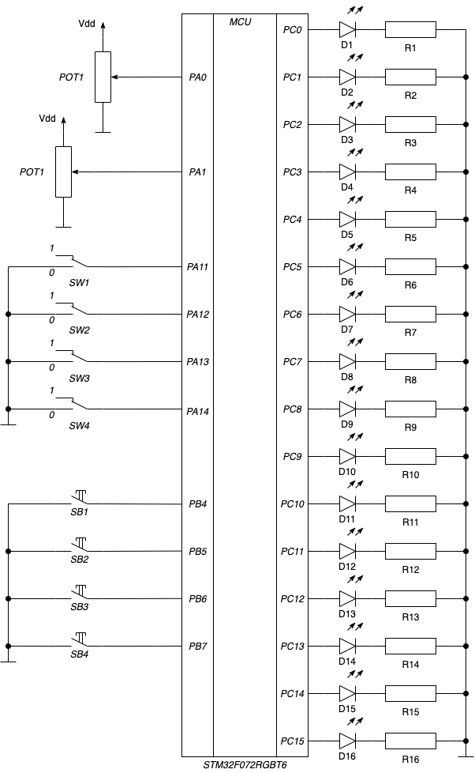

# Лабораторная работа №1

## Цель

В данной лабораторной работе будут изучены основы языка программирования C, базовые навыки работы
с отладчком среды разработки, а также программирование и загрузка программы в _Учебный стенд_.

## Подготовка к работе

При подготовке к данной работе необходимо изучить основы программирования на языке C,
научится компилировать и загружать программу.

## Режим _Учебного стенда_ и функциональная схема

Примеры `c_lang` и `c_lang_str` могут выполняться на симуляторе или на учебном стенде.

Для выполнения примера `gpio` следует установить переключатели _S1_ и _S2_ в положение _0_ на учебном стенде.
При этом должен загореться светодиод LED1 _While LED_, обозначающий режим стенда номер _0_.
Переключатели _S3_ и _S4_ также должны быть установлены в положении _0_.



В этом режиме к выводам микроконтроллера _PA0_, _PA1_ подключены два потенциометра _POT1_ и _POT2_.
Выводы микроконтроллера _PA11-PA14_ подключены к переключателям _SW1-SW4_.
Выводы микроконтроллера _PB4-PB7_ подключены к тактовым кнопкам _SB1-SB4_.
К выводам _PC0-PC15_ подключены 16 светодиодов _D1-D16_.

## Описание задач

На лабораторной работе решаются три задачи:

* `c_lang` - _Язык программирования С_.
    Простейшая программа для ознакомления с возможностями языка программирования  С. Программу следует выполнять в отладчике по шага с отлеживаением изменения состояния переменных.
* `gpio` - _Мигающий светодиод_.
    Простейшая программа для  включение и выключение светодиода.
    В программе происходит обращение к регистром специальных функций
    порта ввода/вывода для управления состояния светодиода.
* `c_lang_str` - _Строки в языке программирования C_.
    Использование строк и потока вывода в языке C.

## Перенаправление потока вывода `stdout` в окно отладки

Менеджер пакетов `Run-Time Environment` среды разработки имеет модуль `Event Recorder`,
который позволяет печатать строки в окне `Debug (printf) Viewer` отладчика с помощью
функции `printf`.

Для этого в менеджере пакетов `Manage Run-Time Environment` необходимо выбрать компонент
`Event Recorder` и выбрать перенаправление `stdout` на `EVR`.


В исходном коде программы необходимо подключить модуль `EventRecorder.h` и провести его инициализацию вызвав функцию `EventRecorderInitialize(EventRecordAll, 1);`.

После этого можно использовать функцию `printf` из стандартной библиотеки `stdio.h`.

```c
#include "stdio.h"
#include "EventRecorder.h"

int main(void)
{
    EventRecorderInitialize(EventRecordAll, 1);

    printf("Hello, world!\n");

    for(;;);
}
```

Для просмотра вывода неоходимо открыть окно `Debug (printf) Viewer` в отладчике, выбрав `View - Serial Windows - Debug (printf) Viewer`.

Вывод `printf`:


